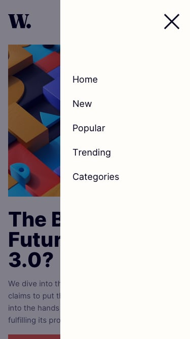

# News Homepage Main

Fiz este desafio, disponível no <a href="https://www.frontendmentor.io?ref=challenge" target="_blank">Front-end Mentor</a>

## O desafio
Consiste em criar uma página com várias informações separadas. Utilizei o *grid area* do `display: grid;`

## Tecnologias utilizadas
- HTML5
- CSS3
- Javascript *ainda não inciado módulo de JS*

Também será utilizado JS para concluir a parte do menu "flutuante" quando está em telas pequenas..
___

### Dificuldades

- Na *div class="imagem"*, fiz a responsividade das imagens utilizando o ``display: none``.

Essa parte será feito posteriormente com **JS**.